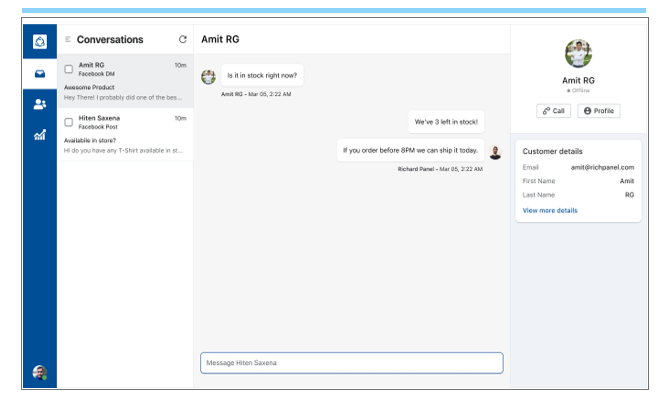
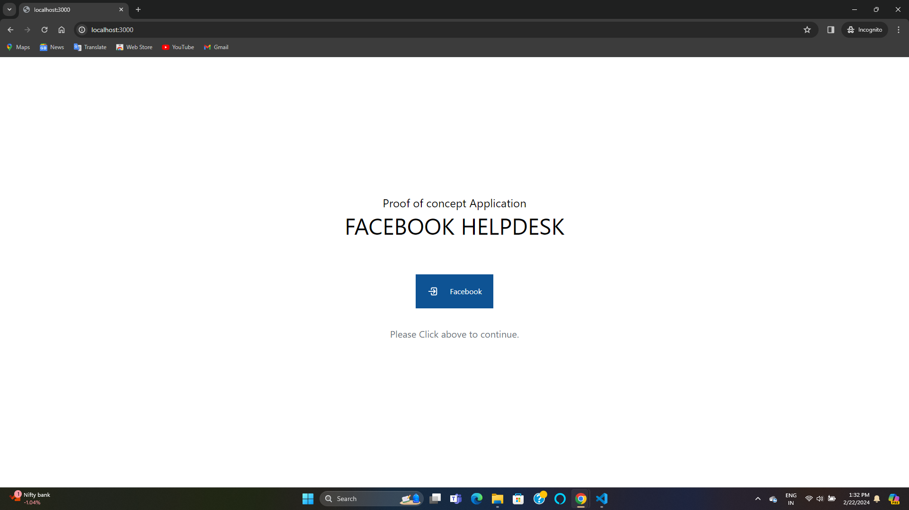
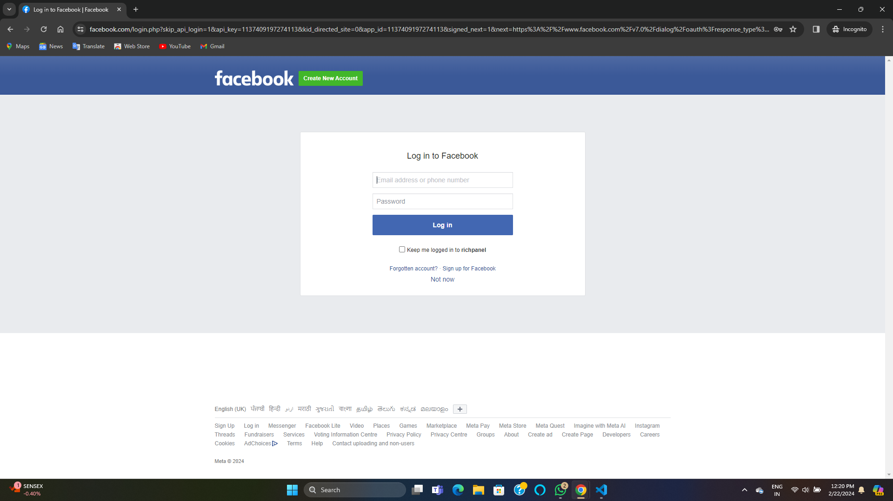
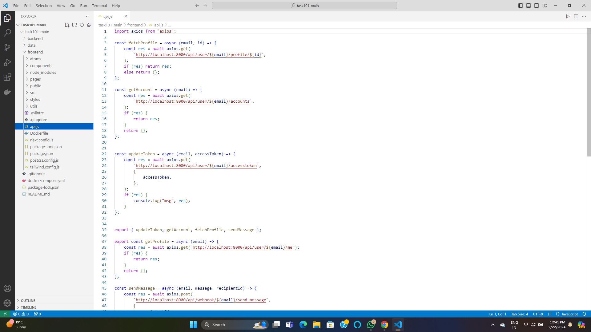
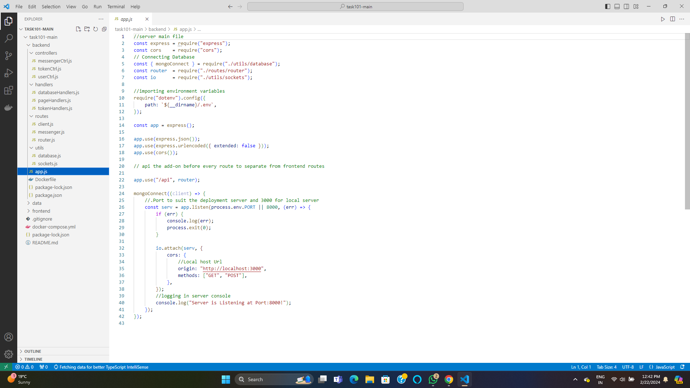
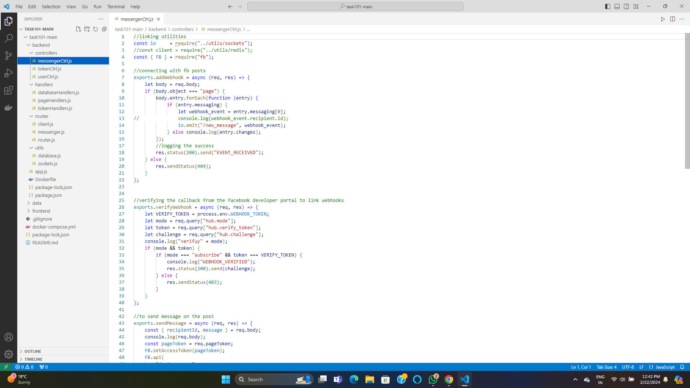
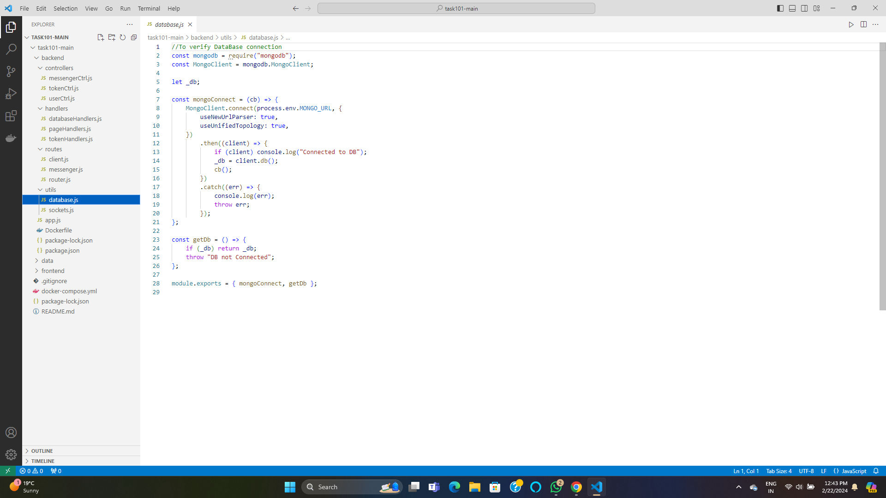
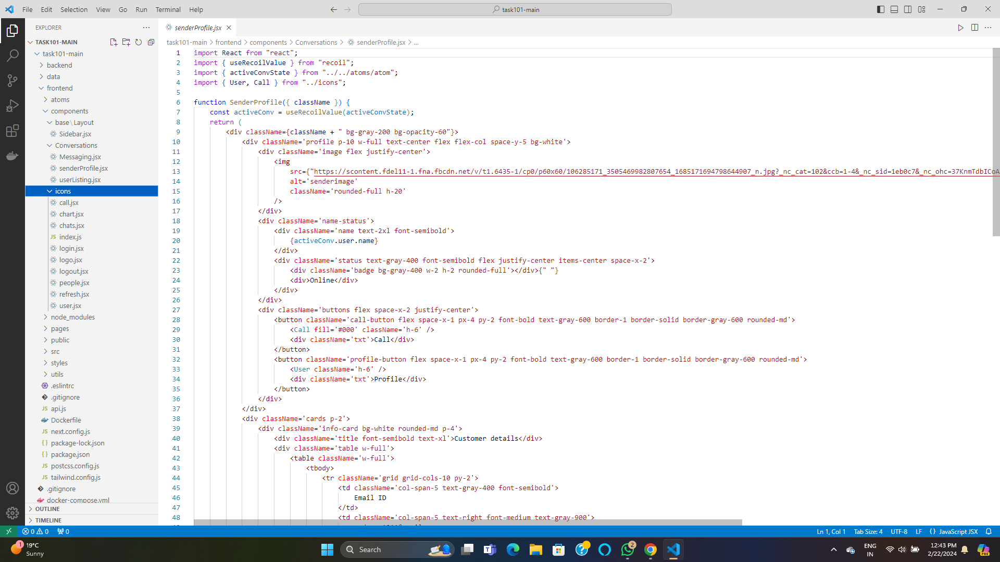

This app will allow clients to connect their fb accounts, listen to their comments or messenger messages and reply to them within the application.

<h1 align="center">
  
</h1>

## Key Features

* Login using Facebook login id and password
* Real time chat update with auto refreshing
* Time stamp to segeregate the messages

## Technologies and Third party libraries

A few things to note in the project:
* **[Node.js]()** - Node.js® is a JavaScript runtime built on Chrome's V8 JavaScript engine. 
* **[React JS]()** - A JavaScript library for building user interfaces.
* Docker - Docker script to start service in production mode.
* **[Mongo Database](#)** - MongoDB is a source-available cross-platform document-oriented database program. Classified as a NoSQL database program, MongoDB uses JSON-like documents with optional schemas. 
* **[Webhooks]()** - Webhooks allows you to receive real-time HTTP notifications of changes to specific objects in the Facebook Social Graph.

## Customer App

  
  
  

## Code Pics

  
  
  
  
  

## Reference

Refer these documents for development 
○	https://developers.facebook.com/docs/messenger-platform/ 
○	https://developers.facebook.com/docs/pages/ 
○	https://developers.facebook.com/docs/facebook-login/  

